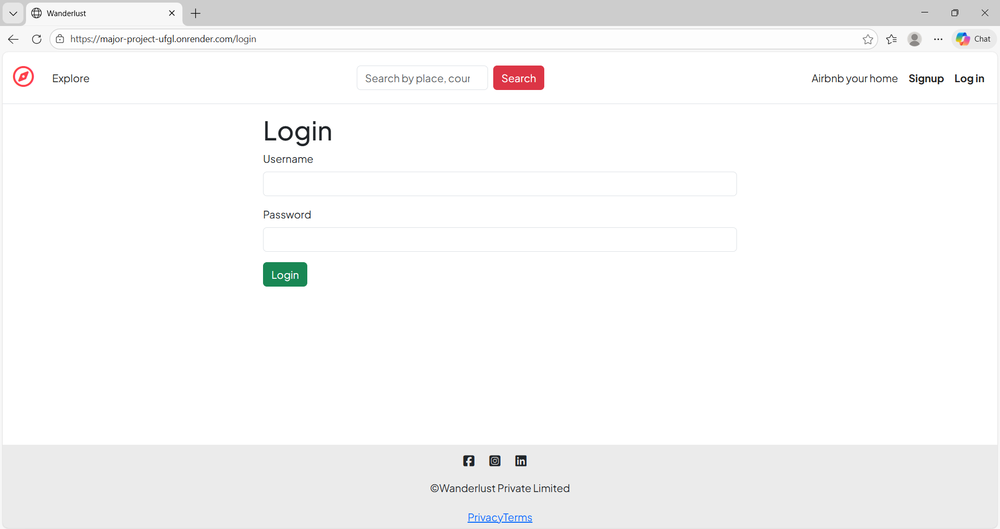
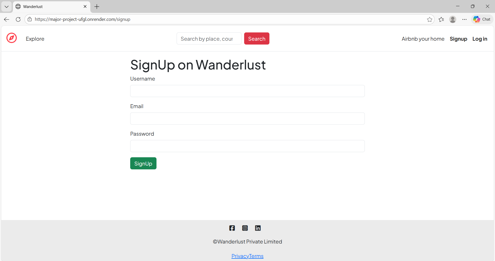
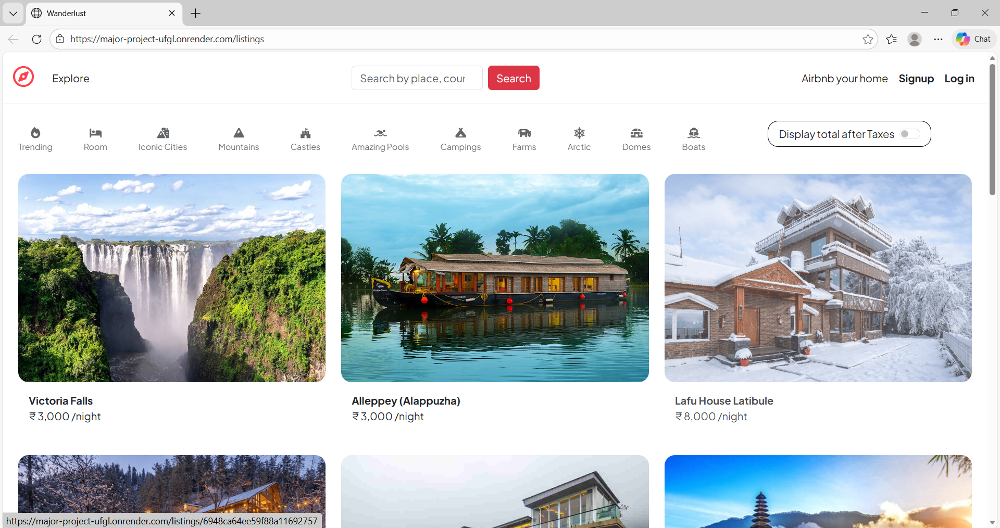
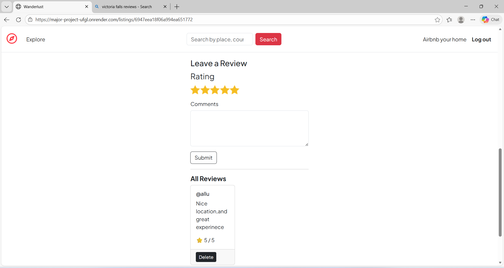

# WanderLust 🏠

Full-stack travel accommodation platform inspired by Airbnb, built using Node.js, Express.js, MongoDB, and modern authentication.

---

## ✨ Features

- User authentication (Sign up, Login, Logout)
- Create, edit, and delete property listings (CRUD)
- Review and rating system for listings
- Image upload using Cloudinary
- Secure session handling and authorization

---

## 🛠️ Tech Stack

**Backend**
- Node.js
- Express.js
- MongoDB
- Mongoose

**Authentication & Security**
- Passport.js
- bcrypt
- express-session

**Frontend**
- EJS
- HTML
- CSS
- Bootstrap

**Deployment**
- Render

---

## ⚙️ Installation & Setup
## 🚀 Quick Start

1. **Clone the repo**

git clone https://github.com/Aliya3303/Major-Project.git

 cd Major-Project

2. **Install dependencies**

 npm install

3. **Setup environment** (copy `.env.example` to `.env`)

DB_URL=your_mongodb_atlas_connection_string

CLOUDINARY_CLOUD_NAME=your_cloudinary_name

CLOUDINARY_KEY=your_api_key

CLOUDINARY_SECRET=your_secret

SESSION_SECRET=your_random_secret_key

4. **Run locally**

 npm start

Visit: http://localhost:8080

## 📁 Project Structure

Major-Project/
├── models/         
├── routes/          
├── views/           
├── public/          
├── middleware/      
├── app.js           
├── package.json
└── README.md

## 🔗 Live Deployment

**Note**: Free Render tier sleeps after 15min inactivity (wakes in 20-40s)

- 🌐 **Demo**: https://major-project-ufgl.onrender.com/listings

## 🎯 Learning Outcomes

- Full-stack MERN development with authentication
- MongoDB relationships (User → Listings → Reviews)
- Secure file uploads and third-party API integration
- Production deployment with environment variables

## 👩‍💻 Author

**Shaik Aliya**  
💼 [LinkedIn](https://linkedin.com/in/shaik-aliya-b03b75359) 
🐙 [GitHub](https://github.com/Aliya3303)

---
⭐ **Star this repo if you found it helpful!**

## 🖼️ Screenshots

### Login Page

### Sign Up Page

### Listings Page

### Create Listing

### Edit Listing

### View Listing

### Reviews

